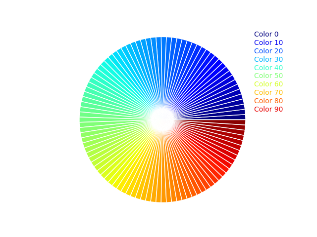

# HTML笔记

* `<!DOCTYPE html>` 声明为 HTML5 文档
* `<html>` HTML 页面的根元素
* `<head>` 文档的元（meta）数据，如 `<meta charset="utf-8">` 定义网页编码格式为 utf-8。
* `<title> `标题
* `<body>` 元素包含了可见的页面内容
* `<h1 title='大标题'>` 大标题
* `<p>` 段落
* `<a href="https://www.runoob.com">这是一个链接</a>`插入链接，其中`href`叫做属性，位于括号内，用`""`括起来
* ``插入图像
* `<br>`换行，有多个就空多行
* `<hr>`水平线
* `<!--注释-->`注释
* `<b>文本</b>`加粗
* `<i>文本</i>`斜体
* `<sub>下标</sub>`和`<sup>上标</sup>`
* `<pre> </pre>`之间的文本空格，换行不用符号直接输入即可
* `<del>删除</del> <ins>插入</ins>`
* `<code>计算机代码，相当于``<code>`

#### 一个具体例子: 
```html
<!DOCTYPE html>
<html>
<head>
<meta charset="utf-8">
<title>菜鸟教程(runoob.com)</title>
</head>
<body>
    <h1>我的第一个标题</h1>
    <p>我的第一个段落。</p>
    <pre>
    此例演示如何使用 pre 标签
    对空行和    空格
    进行控制
    </pre>
</body>
</html>
```

## 属性

* 像`href`, `src`, `alt`这些都是属性，有的必须用在特定的元素里面，有的可以通用。

* 比如`style`所有元素可用，直接在元素上应用 CSS 样式: `<p style="color: blue; font-size: 14px;">`，`title`所有元素可用，为元素提供额外的提示信息，通常在鼠标悬停时显示，如`<p title="段落">`

## 其他文本

### 地址
```html
<address>
Written by <a href="mailto:webmaster@example.com">Jon Doe</a>.<br> 
Visit us at:<br>
Example.com<br>
Box 564, Disneyland<br>
USA
</address>
```
### 链接

* `href`定义链接目标: `<a href="https://www.example.com">访问 Example</a>`，显示为<a href="https://www.example.com" title='example.com'>访问 Example</a>

* `target`: 定义链接的打开方式。
`_blank`: 在新标签页中打开链接。
`_self`: 在当前窗口打开链接（默认）。
`_parent`: 在父框架中打开链接。
`_top`: 在整个窗口中打开链接，取消任何框架。

例如`<a href="https://www.example.com" target="_blank" rel="noopener">新窗口打开 Example</a>`

* 锚点链接：同一页面下跳转到指定位置，指定位置用id表示
```html
<a href="#section1">跳转到第1部分</a>
<br>
<br>
<div id="section1">这是第1部分</div>
```

* 图像链接：点击图像跳转链接
```html
<a href="https://www.example.com">
  
</a>
```
<a href="https://www.example.com">
  
</a>

### 居中
`<h1 style="text-align:center;">居中对齐的标题</h1>`

### 特殊样式

<div style="opacity:0.5;position:absolute;left:50px;width:300px;height:150px;background-color:#40B3DF"></div>

<!--div style="font-family:times;padding:2px;border-radius:100px;border:10px solid #EE872A;"-->

<div style="opacity:0.3;position:absolute;left:120px;width:100px;height:200px;background-color:#8AC007"></div>

<h3>Look! Styles and colors</h3>

<div style="letter-spacing:8px;">Manipulate Text</div>

<div style="color:#40B3DF;">Colors
<span style="background-color:#B4009E;color:#ffffff;">Boxes</span>
</div>

<div style="color:#DD00AA;">and more...</div>


```html
<div style="opacity:0.5;position:absolute;left:50px;width:300px;height:150px;background-color:#40B3DF"></div>

<div style="font-family:times;padding:20px;border-radius:100px;border:1px solid #EE872A;">

<div style="opacity:0.3;position:absolute;left:120px;width:100px;height:200px;background-color:#8AC007"></div>

<h3>Look! Styles and colors</h3>

<div style="letter-spacing:8px;">Manipulate Text</div>

<div style="color:#40B3DF;">Colors
<span style="background-color:#B4009E;color:#ffffff;">Boxes</span>
</div>

<div style="color:#DD00AA;">and more...</div>
```


### 表格`<table> </table>`

* `tr`: table row 的缩写，表格的一行。
* `td`: table data 的缩写，数据单元格。
* `th`: table header的缩写，表格的表头单元格

<table border="0">
<caption><b>标题</b></caption>
  <thead>
    <tr>
      <th>列标题1</th>
      <th>列标题2</th>
      <th>列标题3</th>
    </tr>
  </thead>
  <tbody>
    <tr>
      <td>行1，列1</td>
      <td>行1，列2</td>
      <td>行1，列3</td>
    </tr>
    <tr>
      <td>行2，列1</td>
      <td>行2，列2</td>
      <td>行2，列3</td>
    </tr>
  </tbody>
</table>

### 列表`<ul> </ul>和<ol> </ol>`

#### 无序列表

<ul>
  <li>Coffee</li>
  <li>Tea
    <ul>
      <li>Black tea</li>
      <li>Green tea
        <ul>
          <li>Good</li>
          <li>Not good</li>
        </ul>
      </li>
    </ul>
  </li>
  <li>Milk</li>
</ul>

#### 有序列表

<ol>
<li>Coffee</li>
<li>Milk</li>
<li>Water</li>
</ol>

#### 自定义列表

<dl>
<dt>Coffee</dt>
<dd>- black hot drink</dd>
<dt>Milk</dt>
<dd>- white cold drink</dd>
<dt>Water</dt>
<dd>- H2O</dd>
</dl>

## 表单`<form> </form>`

表单用于收集用户的输入信息。
* `<form>`创建表单，**属性：**`action` 属性定义了表单数据提交的目标 URL，`method` 属性定义了提交数据的 HTTP 方法（这里使用的是 "post"）。
* `<label>` 添加标签，提高可访问性。
* `<input>` 创建文本输入框、密码框等。`type` 属性定义了输入框的类型，`id` 属性用于关联 
* `<label>` 元素，`name` 属性用于标识表单字段。
* `<select>` 创建下拉列表，而 `<option>` 元素用于定义下拉列表中的选项。

**例子：**
```html
<form action="/" method="post">
    <!-- 文本输入框 -->
    <label for="name">用户名:</label>
    <input type="text" id="name" name="name" required>

    <br>

    <!-- 密码输入框，显示为圆点 -->
    <label for="password">密码:</label>
    <input type="password" id="password" name="password" required>

    <br>

    <!-- 单选按钮 -->
    <label>性别:</label>
    <input type="radio" id="male" name="gender" value="male" checked>
    <label for="male">男</label>
    <input type="radio" id="female" name="gender" value="female">
    <label for="female">女</label>

    <br>

    <!-- 复选框 -->
    <input type="checkbox" id="subscribe" name="subscribe" checked>
    <label for="subscribe">订阅推送信息</label>

    <br>

    <!-- 下拉列表 -->
    <label for="country">国家:</label>
    <select id="country" name="country">
        <option value="cn">CN</option>
        <option value="usa">USA</option>
        <option value="uk">UK</option>
    </select>

    <br>

    <!-- 提交按钮 -->
    <input type="submit" value="提交">
</form>
```
<br><br>

# CSS笔记
## 调用CSS的两种方法：

## 1. 通过<link>的属性href来引用写好的css文件

```html
<!DOCTYPE html>
<html>
<head>
    <meta charset="UTF-8">
    <meta name="viewport" content="width=device-width, initial-scale=1.0">
    <title>我的 CSS 练习</title>
    <link rel="stylesheet" href="style.css">
</head>
<body>
 
    <div class="card">
        <h1>Hello, CSS!</h1>
        <p>这是我用 VS Code 写的第一个样式卡片。</p>
        <button>点击我</button>
    </div>
 
</body>
</html>
```

## 2. 也可以在html中自定义样式来采用样式，但是在html中用`<style> </style>`包起来

```html
<style>
p  <!--指定段落的css格式>
{
	color:red;
	text-align:center;
} 
</style>
</head>

<body>
<p>Hello World!</p>
```

## CSS 的id选择器：只渲染指定区域的样式，前面加`#`，`id='id的名字'`

```html
<style>
#para1
{
	text-align:center;
	color:red;
} 
</style>

<p id="para1">Hello World!</p>
<p>这个段落不受该样式的影响。</p>
```

## class选择器：一次性渲染多个区域的样式
`.center {text-align:center;}`

指定内容渲染样式，如指定段落就`p.`：

`p.center {text-align:center;}`

## CSS背景
* **背景颜色`body {background-color:#b0c4de;}`**

* **其他部分颜色：**
```css
h1 {background-color:#6495ed;}
p {background-color:#e0ffff;}
div {background-color:#b0c4de;}
```

* **图像重复和位置：**

`background-repeat:repeat-x;`或者`no-repeat;`，位置：`background-position:right top;`，固定：`background-attachment:fixed;`


